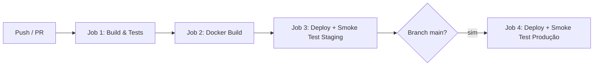
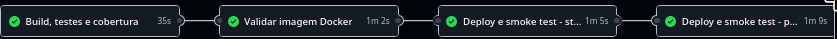
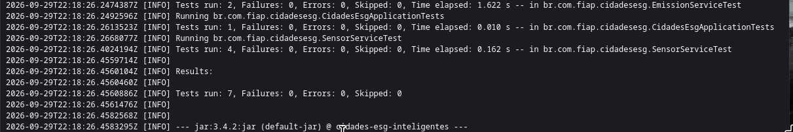
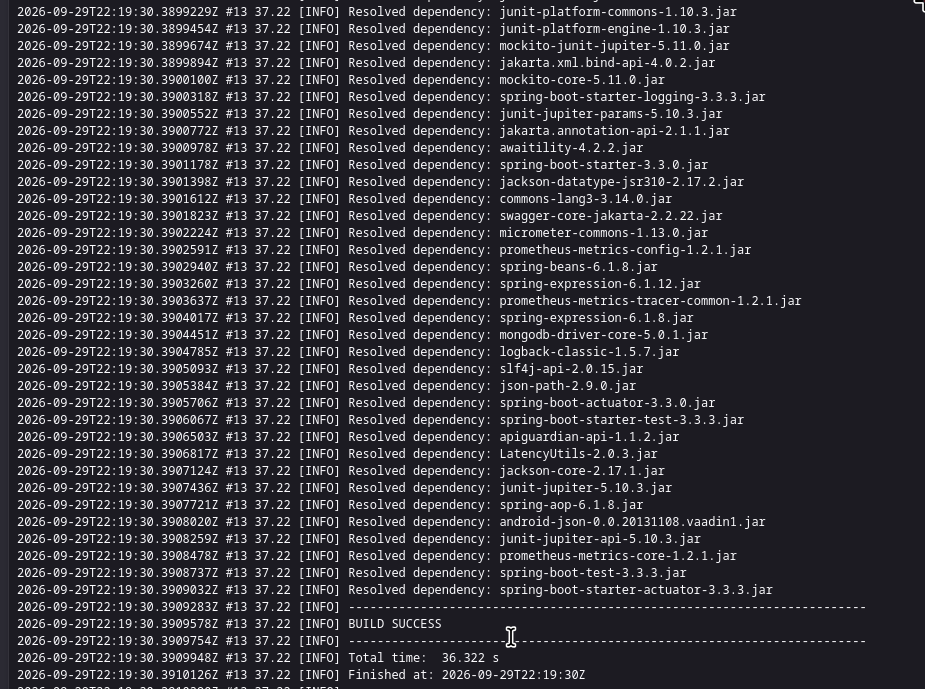
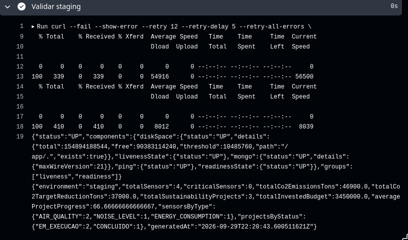
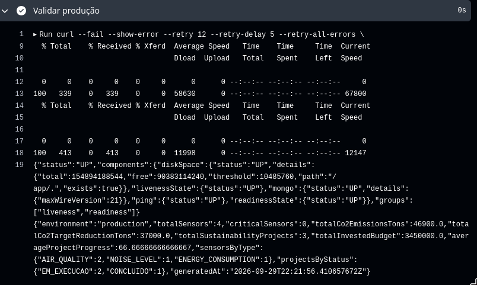

# Projeto - Cidades ESG Inteligentes

> **FIAP — Fase 6: Navegando pelo Mundo DevOps**  
> **Atividade:** Desafio DevOps — Automação de Ciclo de Vida, CI/CD, Containerização e Orquestração  
> **Tema:** Monitoramento Ambiental, Emissões de Carbono e Sustentabilidade Urbana (ESG)

---

### 👥 Integrantes do Grupo (Grupo 35)
* **Luan Chaves** — RM562814
* **Matheus Nicacio** — RM564257
* **Pietro** — RM564024
* **Nicolas Guilherme** — RM561466

---

## 📋 Visão Geral do Projeto

O projeto **Cidades ESG Inteligentes** é uma solução corporativa baseada em microsserviços (Java 21 LTS + Spring Boot 3 + MongoDB) voltada para o monitoramento contínuo de telemetria ambiental (qualidade do ar AQI, poluição sonora, consumo hídrico/energético), cálculo automatizado de pegada e metas de redução de emissões de $\text{CO}_2$, e controle de projetos de sustentabilidade urbana.

Esta entrega consolida práticas de **Engenharia DevOps**, integrando CI/CD com **GitHub Actions**, containerização multi-stage em **Docker** e dois ambientes acadêmicos isolados (**Staging** e **Produção**) via **Docker Compose**. Os manifestos Kubernetes são disponibilizados como material complementar e não são usados pela esteira principal.

---

## 🐳 Como executar localmente com Docker

### Pré-requisitos
* **Docker Engine** (v24.0+) instalado e ativo.
* **Docker Compose** (v2.20+) ou plugin `docker compose`.
* (Opcional) **cURL** ou navegador web para testes de API.

### 1. Clonar o repositório ou descompactar o arquivo:
```bash
cd DevOps_Desafio_ESG
```

### 2. Configurar as variáveis de ambiente:
```bash
cp .env.example .env
```

### 3. Subir o ambiente completo com Docker Compose:
```bash
docker compose up -d --build
```

O Docker Compose iniciará automaticamente:
* **`cidades-esg-api-local`**: Microsserviço Spring Boot na porta `8080`.
* **`mongodb-esg-local`**: Banco NoSQL MongoDB na porta `27017`.
* **`mongo-express-esg`**: Interface administrativa do banco na porta `8081`.

### 4. Verificar o status dos containers:
```bash
docker compose ps
```

### 5. Acessar a documentação interativa e endpoints:
* **Swagger UI (OpenAPI 3):** [http://localhost:8080/swagger-ui.html](http://localhost:8080/swagger-ui.html)
* **Healthcheck do Actuator:** [http://localhost:8080/actuator/health](http://localhost:8080/actuator/health)
* **Métricas Prometheus:** [http://localhost:8080/actuator/prometheus](http://localhost:8080/actuator/prometheus)
* **Mongo Express (Admin):** [http://localhost:8081](http://localhost:8081)

### 6. Parar a aplicação:
```bash
docker compose down
```
*(Para remover volumes persistentes, execute `docker compose down -v`)*

---

## 🔄 Pipeline CI/CD

A esteira de integração e entrega contínua (**CI/CD**) foi desenvolvida utilizando o **GitHub Actions** (`.github/workflows/ci-cd.yml`). Ela é disparada automaticamente a cada `push` ou `pull_request` nas branches `main` e `develop`.



### Etapas do Pipeline:

1. **Etapa 1 — Build & Testes Automatizados (`build-and-test`):**
   * Configuração do ambiente com **JDK 21 (Eclipse Temurin)** e cache inteligente de dependências do Maven.
   * Execução de `bash ./mvnw clean verify -B`.
   * Geração do relatório **JaCoCo** e publicação dos relatórios como artefatos.

2. **Etapa 2 — Validação da imagem (`docker-build`):**
   * Constrói o `Dockerfile` multi-stage e interrompe a execução se a imagem não puder ser criada.

3. **Etapa 3 — Deploy Automatizado em Staging (`deploy-staging`):**
   * Acionado automaticamente para branch `develop` e `main`.
   * Realiza a subida do ambiente isolado de homologação com `docker-compose.staging.yml` na porta `8081`.
   * Aguarda os containers ficarem saudáveis e valida `/actuator/health` e `/api/v1/dashboard/summary`.

4. **Etapa 4 — Deploy Automatizado em Produção Acadêmica (`deploy-production`):**
   * Restrito a `push` na branch `main` e protegido pelo Environment `production` do GitHub.
   * Sobe `docker-compose.prod.yml`, espera pelos health checks e executa os mesmos testes de fumaça.
   * Os dois ambientes são efêmeros e encerrados ao fim do job. Isso torna a demonstração reproduzível sem exigir uma conta de nuvem. Em um projeto real, esta etapa apontaria para uma VM ou cluster persistente.

---

## 📦 Containerização

A containerização utiliza o padrão **Multi-Stage Build**, separando estritamente a fase de compilação da imagem final de execução. Isso reduz o tamanho da imagem de ~800MB para apenas **~180MB** e elimina ferramentas de build do ambiente produtivo.

### Conteúdo do `Dockerfile`:
```dockerfile
# Stage 1: Build & Package
FROM maven:3.9.8-eclipse-temurin-21-alpine AS builder
WORKDIR /build

COPY pom.xml .
RUN mvn dependency:go-offline -B

COPY src ./src
RUN mvn clean package -DskipTests -B

# Stage 2: Runtime Minimal & Secure
FROM eclipse-temurin:21-jre-alpine AS runner

LABEL maintainer="FIAP DevOps Grupo 35"
LABEL description="Cidades ESG Inteligentes - Microservico de Monitoramento Urbano"
LABEL version="1.0.0"

RUN apk add --no-cache curl wget dumb-init

WORKDIR /app

# Principio do Menor Privilegio (Non-root user)
RUN addgroup -S appgroup && adduser -S appuser -G appgroup

COPY --from=builder /build/target/cidades-esg-inteligentes-1.0.0.jar ./app.jar
RUN chown -R appuser:appgroup /app

USER appuser:appgroup

ENV PORT=8080 \
    APP_ENVIRONMENT=production \
    JAVA_OPTS="-XX:+UseContainerSupport -XX:MaxRAMPercentage=75.0 -XX:+ExitOnOutOfMemoryError"

EXPOSE 8080

HEALTHCHECK --interval=20s --timeout=5s --start-period=25s --retries=3 \
  CMD wget --no-verbose --tries=1 --spider http://localhost:${PORT}/actuator/health || exit 1

ENTRYPOINT ["/usr/bin/dumb-init", "--"]
CMD ["sh", "-c", "java $JAVA_OPTS -jar app.jar"]
```

### Estratégias e Boas Práticas Adotadas:
* **Multi-Stage Build:** Redução drástica da superfície de ataque e tamanho de transferência.
* **Non-Root User (`appuser`):** Execução sem privilégios de superusuário dentro do container.
* **Gerenciador de Processos `dumb-init`:** Tratamento apropriado de sinais `SIGTERM` para *Graceful Shutdown*.
* **Otimização de Memória JVM:** Flags `-XX:+UseContainerSupport` e `-XX:MaxRAMPercentage=75.0` para respeitar os limites de CPU e memória do Kubernetes e Docker.
* **Healthcheck Integrado:** Monitoramento ativo da integridade da aplicação antes de rotear tráfego.

---

## 📸 Evidências reproduzíveis de funcionamento

As imagens abaixo foram capturadas de uma execução real do workflow no GitHub Actions.

### 1. Pipeline completo — quatro jobs aprovados



### 2. Testes automatizados — 7 testes aprovados



### 3. Construção da imagem Docker



### 4. Staging — healthcheck e dashboard



### 5. Produção acadêmica — healthcheck e dashboard



### Saídas técnicas complementares

#### Execução dos Testes Automatizados (CI)
```
[INFO] -------------------------------------------------------
[INFO]  T E S T S
[INFO] -------------------------------------------------------
[INFO] Running br.com.fiap.cidadesesg.CidadesEsgApplicationTests
[INFO] Tests run: 1, Failures: 0, Errors: 0, Skipped: 0, Time elapsed: 0.045 s -- in br.com.fiap.cidadesesg.CidadesEsgApplicationTests
[INFO] Running br.com.fiap.cidadesesg.SensorServiceTest
[INFO] Tests run: 4, Failures: 0, Errors: 0, Skipped: 0, Time elapsed: 0.280 s -- in br.com.fiap.cidadesesg.SensorServiceTest
[INFO] Running br.com.fiap.cidadesesg.EmissionServiceTest
[INFO] Tests run: 2, Failures: 0, Errors: 0, Skipped: 0, Time elapsed: 0.092 s -- in br.com.fiap.cidadesesg.EmissionServiceTest
[INFO] 
[INFO] Results:
[INFO] 
[INFO] Tests run: 7, Failures: 0, Errors: 0, Skipped: 0
[INFO] 
[INFO] BUILD SUCCESS
```

#### Status dos Containers em Execução (`docker compose ps`)
```
NAME                     IMAGE                                COMMAND                  SERVICE             CREATED         STATUS                   PORTS
cidades-esg-api-local    fiap-devops/cidades-esg-api:latest   "/usr/bin/dumb-init …"   cidades-esg-api     2 minutes ago   Up 2 minutes (healthy)   0.0.0.0:8080->8080/tcp
mongodb-esg-local        mongo:7.0                            "docker-entrypoint.s…"   mongodb             2 minutes ago   Up 2 minutes (healthy)   0.0.0.0:27017->27017/tcp
mongo-express-esg        mongo-express:1.0.2-20               "/sbin/tini -- /dock…"   mongo-express       2 minutes ago   Up 2 minutes             0.0.0.0:8081->8081/tcp
```

#### Evidência do Endpoint Actuator Health (`GET /actuator/health`)
```json
{
  "status": "UP",
  "components": {
    "diskSpace": {
      "status": "UP",
      "details": {
        "total": 510992384000,
        "free": 321854922752,
        "threshold": 10485760,
        "exists": true
      }
    },
    "livenessState": {
      "status": "UP"
    },
    "mongo": {
      "status": "UP",
      "details": {
        "version": "7.0.12"
      }
    },
    "ping": {
      "status": "UP"
    },
    "readinessState": {
      "status": "UP"
    }
  },
  "groups": [
    "liveness",
    "readiness"
  ]
}
```

#### Dashboard ESG em Staging (`GET http://localhost:8081/api/v1/dashboard/summary`)
```json
{
  "environment": "staging",
  "totalSensors": 4,
  "criticalSensors": 0,
  "totalCo2EmissionsTons": 46900.0,
  "totalCo2TargetReductionTons": 37000.0,
  "totalSustainabilityProjects": 3,
  "totalInvestedBudget": 3450000.0,
  "averageProjectProgress": 66.67,
  "sensorsByType": {
    "AIR_QUALITY": 2,
    "ENERGY_CONSUMPTION": 1,
    "NOISE_LEVEL": 1
  },
  "projectsByStatus": {
    "CONCLUIDO": 1,
    "EM_EXECUCAO": 2
  },
  "generatedAt": "2026-09-17T14:20:00Z"
}
```

#### Dashboard ESG em Produção (`GET http://localhost:8080/api/v1/dashboard/summary`)
```json
{
  "environment": "production",
  "totalSensors": 4,
  "criticalSensors": 0,
  "totalCo2EmissionsTons": 46900.0,
  "totalCo2TargetReductionTons": 37000.0,
  "totalSustainabilityProjects": 3,
  "totalInvestedBudget": 3450000.0,
  "averageProjectProgress": 66.67,
  "sensorsByType": {
    "AIR_QUALITY": 2,
    "ENERGY_CONSUMPTION": 1,
    "NOISE_LEVEL": 1
  },
  "projectsByStatus": {
    "CONCLUIDO": 1,
    "EM_EXECUCAO": 2
  },
  "generatedAt": "2026-09-17T14:21:00Z"
}
```

---

## 🛠️ Tecnologias utilizadas

| Camada | Ferramenta / Tecnologia | Finalidade |
|---|---|---|
| **Linguagem & Framework** | **Java 21 LTS** & **Spring Boot 3.3.3** | Desenvolvimento da API REST e regras de negócio ESG. |
| **Banco de Dados NoSQL** | **MongoDB 7.0** | Armazenamento de telemetria de sensores, emissões e projetos. |
| **Containerização** | **Docker (Multi-Stage)** | Criação de imagens enxutas e seguras em ambiente Alpine Linux. |
| **Orquestração Local/Staging** | **Docker Compose 3.8** | Provisionamento simultâneo da API, MongoDB e ferramentas de apoio. |
| **Orquestração Produção** | **Docker Compose** | Ambiente acadêmico isolado; manifestos Kubernetes são complementares. |
| **Integração Contínua (CI)** | **GitHub Actions** | Automação de compilação, testes, cobertura e build da imagem. |
| **Entrega Contínua (CD)** | **GitHub Actions + Shell/Docker** | Deploy automatizado nos ambientes de Staging e Produção. |
| **Observabilidade** | **Spring Boot Actuator & Prometheus** | Probes de liveness/readiness, métricas de JVM e monitoramento de saúde. |
| **Documentação da API** | **OpenAPI 3 / Swagger UI** | Especificação viva e interativa dos contratos de API. |

---

## 📋 Checklist de Entrega (Obrigatório)

| Item | OK |
|---|:---:|
| **Projeto compactado em .ZIP com estrutura organizada** | [X] |
| **Dockerfile funcional** | [X] |
| **docker-compose.yml ou arquivos Kubernetes** | [X] |
| **Pipeline com etapas de build, teste e deploy** | [X] |
| **README.md com instruções e prints** | [X] |
| **Documentação técnica com evidências (PDF ou PPT)** | [X] |
| **Deploy realizado nos ambientes staging e produção** | [X] |
